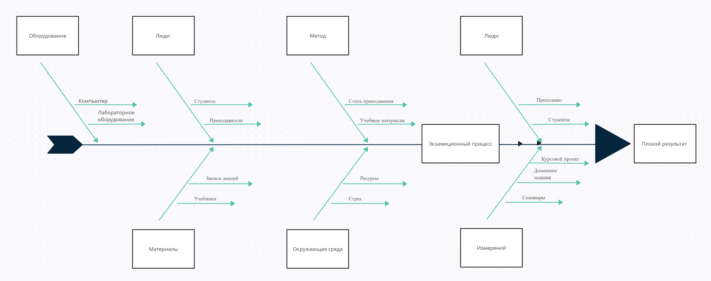

# Проект: itmo_quant_course

## Описание проекта

Этот проект представляет собой совокупность лабораторных работ, созданных в рамках курса/предмета технологии поддержки принятия решений на финансовых рынках и курса математическое моделирование в финансовой сфере. Каждая из лабораторных работ решает определенную задачу и вносит свой вклад в общий контекст проекта.

## Структура проекта

### Лабораторная работа №2: Выработка рекомендация поведения трейдера на основе паттернов и рекомендаций 

Предсказание цены акции на следующий день с помощью технических индикаторов и машинного обучения

### Лабораторная работа №3: X-матрица
План и резултативность прохождения курса в соответствии с ожиданиями 

Расширенный вариант:

### Лабораторная работа №4: Симплекс-метод

Цель работы: исследование и решение задачи линейного программирования с использованием симплекс-метода.
Задачи: 

1. **Формулировка математической модели.** 
2. **Программная реализация.** 

Допустим, у нас есть предприятие, производящее два вида продукции: А и В. Для производства каждого из них требуются определенные ресурсы – сырье, трудовые ресурсы и машинное время. У нас есть ограниченные ресурсы каждого вида, и мы хотим максимизировать прибыль от продажи этих продуктов.

Пусть:

- \(X_1\) - количество продукта A, произведенного в единицу времени
- \(X_2\) - количество продукта B, произведенного в единицу времени

Цель: Максимизировать прибыль \(P\), где \(P\) выражается как линейная функция от \(X_1\) и \(X_2\):

P = 5X_1 + 3X_2

При этом у нас есть ограничения на использование ресурсов:

1. **Сырье:** \(2X_1 + X_2 <= 20\)
2. **Трудовые ресурсы:** \(4X_1 + 2X_2 <= 30\)
3. **Машинное время:** \(X_1 + 2X_2 <=  16\)

Все переменные \(X_1\) и \(X_2\) должны быть неотрицательными: \(X_1 >= 0\) и \(X_2 >= 0\).

Такую задачу можно решить с использованием симплекс-метода, который поможет найти оптимальные значения переменных \(X_1\) и \(X_2\) для максимизации прибыли при соблюдении всех ограничений.